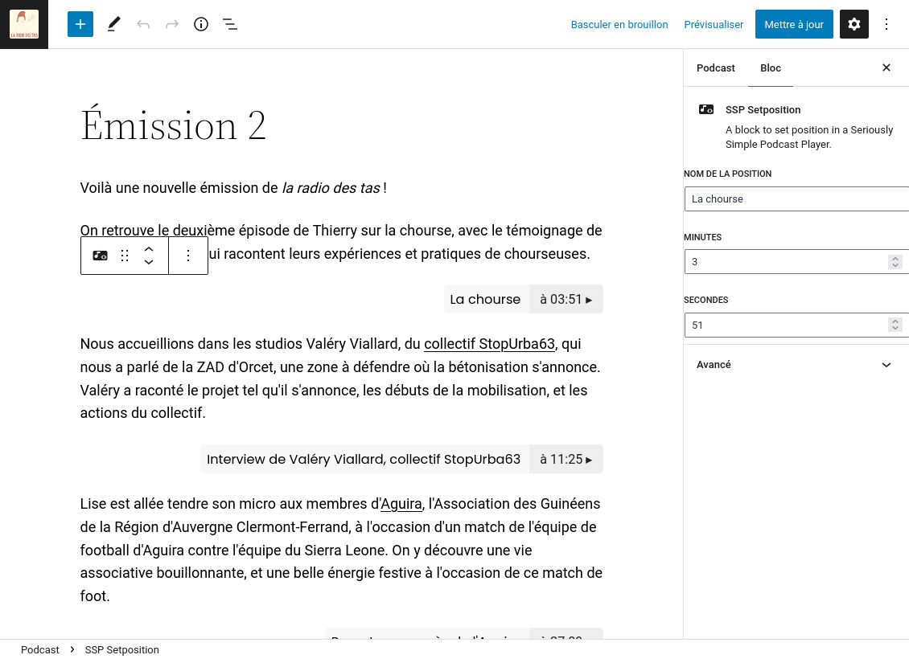
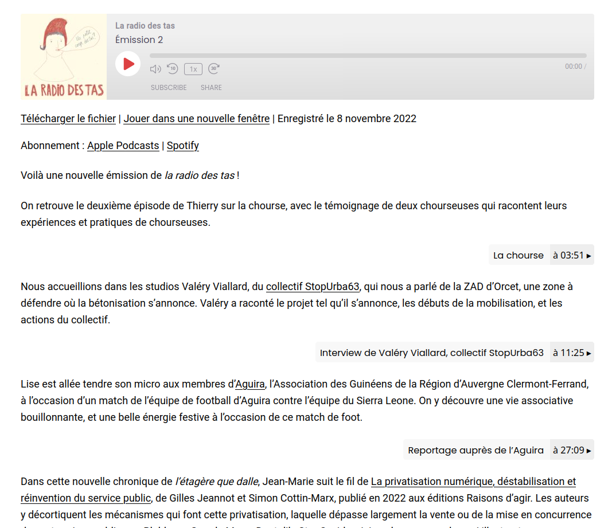

# ssp-setposition

A Gutenberg/Wordpress block to create a bookmark link for [Seriously Simple Podcasting](https://fr.wordpress.org/plugins/seriously-simple-podcasting/) Player.

License: AGPLv3

## Usage

After installing this extension, you can add new **SSP SetPosition** blocks in the body of a podcast. Each block have a name, and a minute and second parameters.

Each of these blocks will be buttons that change the position of the player at the desired timestamp, and play the sound.

## Limitations

* No control is made to detect if the timestamp is correct
* The appearance of the button is not adjustable
* If there is a second player added as a block in the content, the buttons might not work
